# Performance of each pre-trained model

Source databases used to train the models are located [here](https://github.com/ecrl/ecnet/databases).

## Cetane number

  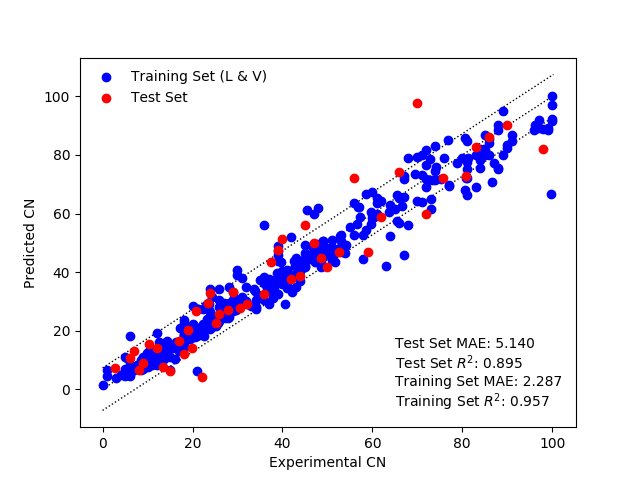 
  Parity plot for cetane number model trained with alvaDesc descriptors

 

  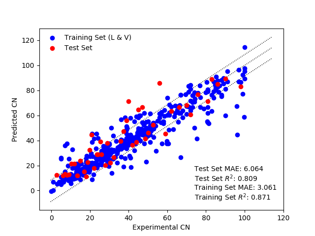 
  Parity plot for cetane number model trained with PaDEL-Descriptor descriptors

 

## Cloud point

  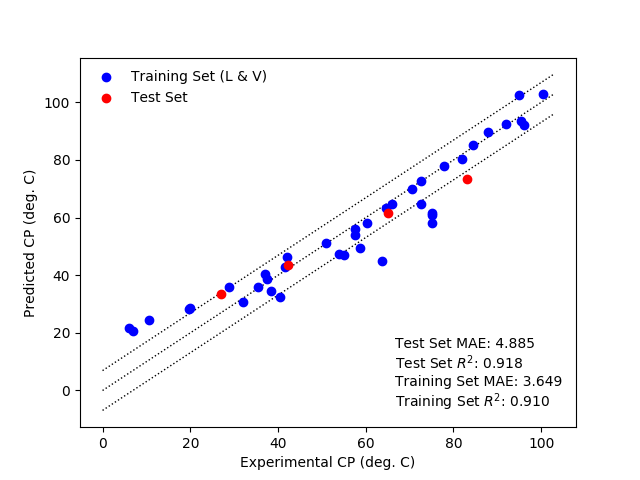 
  Parity plot for cloud point model trained with alvaDesc descriptors

 

  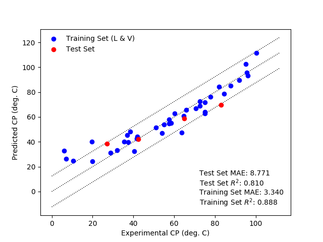 
  Parity plot for cloud point model trained with PaDEL-Descriptor descriptors

 

## Kinematic viscosity

  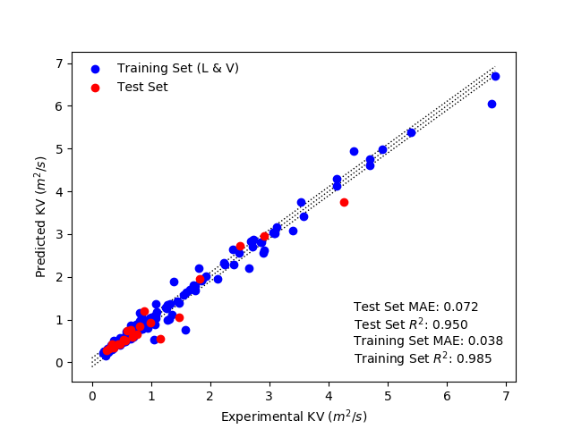 
  Parity plot for kinematic viscosity model trained with alvaDesc descriptors

 

  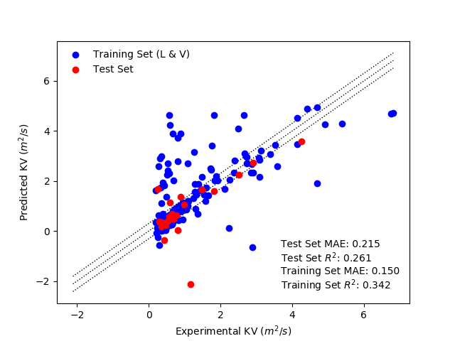 
  Parity plot for kinematic viscosity model trained with PaDEL-Descriptor descriptors

 

## Motor octane number

  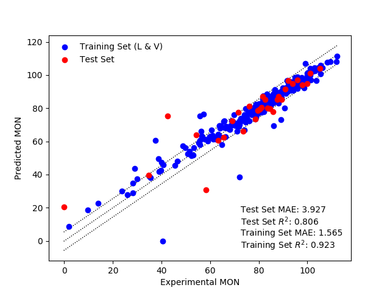 
  Parity plot for motor octane number model trained with alvaDesc descriptors

 

  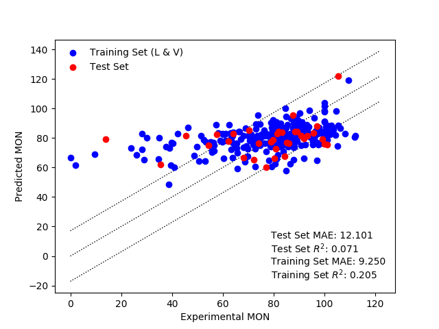 
  Parity plot for motor octane number model trained with PaDEL-Descriptor descriptors

 

## Octane sensitivity

  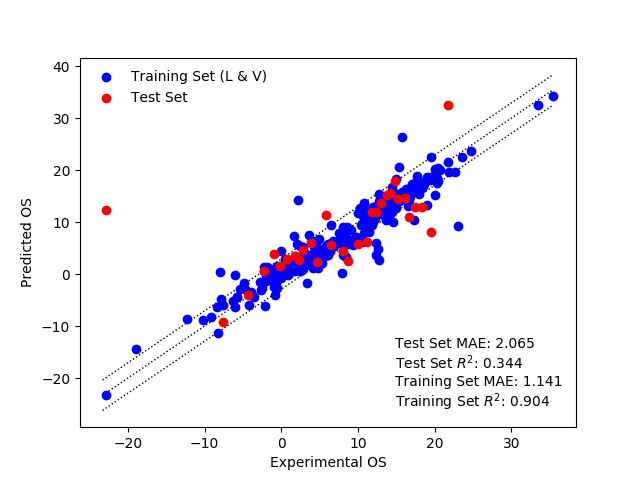 
  Parity plot for octane sensitivity model trained with alvaDesc descriptors

 

  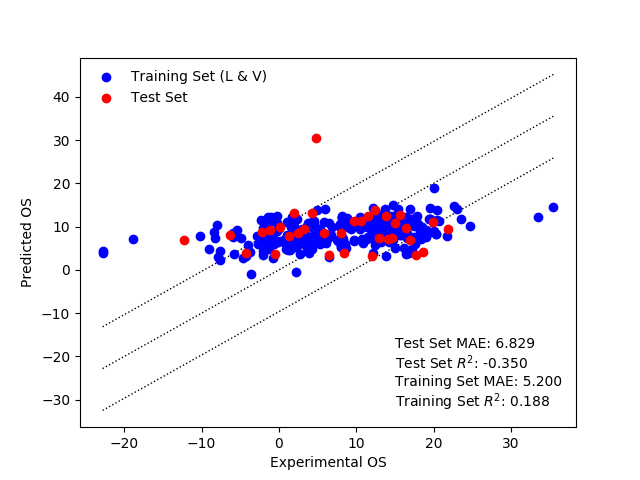 
  Parity plot for octane sensitivity model trained with PaDEL-Descriptor descriptors

 

## Pour point

  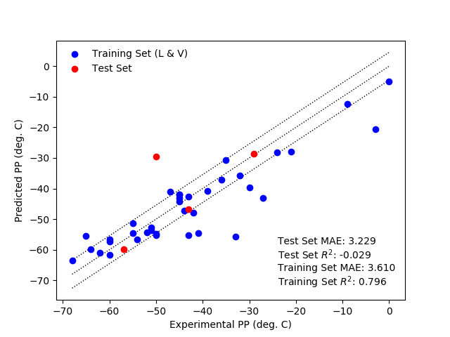 
  Parity plot for pour point model trained with alvaDesc descriptors

 

  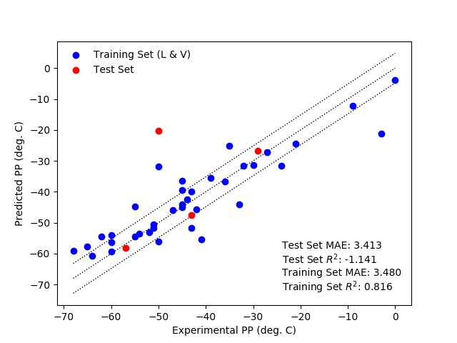 
  Parity plot for pour point model trained with PaDEL-Descriptor descriptors

 

## Research octane number

  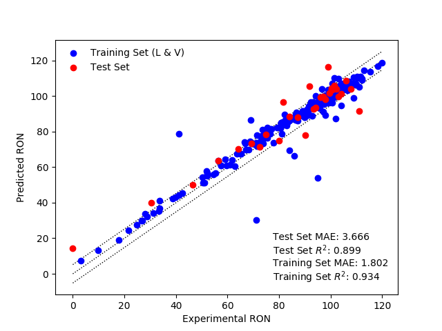 
  Parity plot for research octane number model trained with alvaDesc descriptors

 

  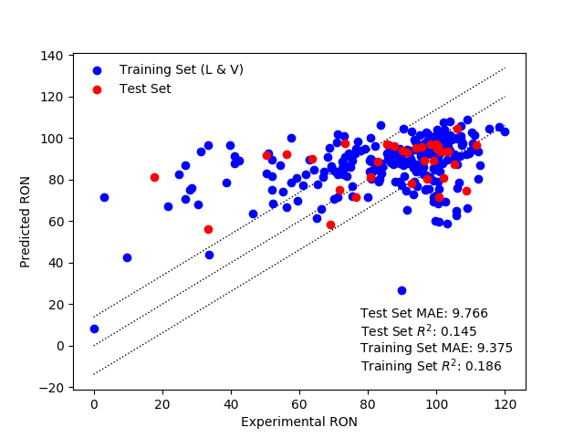 
  Parity plot for research octane number model trained with PaDEL-Descriptor descriptors

 

## Yield sooting index

   
  Parity plot for yield sooting index model trained with alvaDesc descriptors

 

  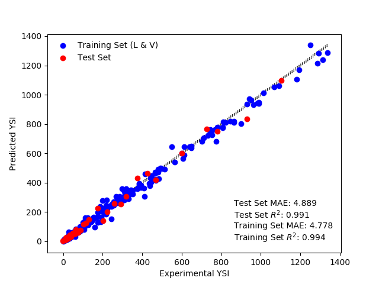 
  Parity plot for yield sooting index model trained with PaDEL-Descriptor descriptors

 
